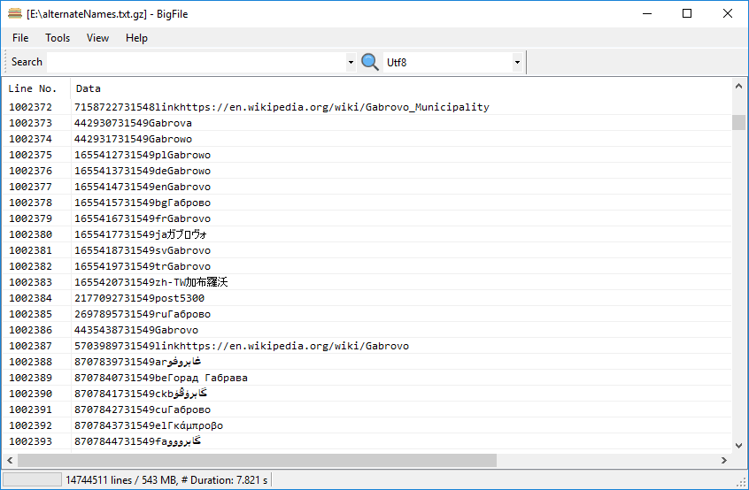

# BigFile (logviewer for very large logfiles)

Bigfile is designed to view and search in very large text files like logfiles, json-dumps, xml-dumps, etc.

It uses the .Net8 runtime.

I needed something like 'less' on unix systems, but easier and for Windows. Stumbled across the logviewer from Mark Woan, which does a lot of good things, but not everything I needed. So I took his approach as an example and created Bigfile.

Main Bigfile features:

- Loading of compressed (.gz or .zip or other) files without unpacking.
- Background loading of files
- Dynamic character encoding (Utf8, Windows, Unicode), which doesn't cause a reload of the file
- Memory compression to support loading huge files in memory
- Multi-threaded search
- Search via boolean expressions and regex (grep).
- Mimics some of less's navigation shortcuts
- Viewing line-content as text/json/xml/csv

Installer can be downloaded from [https://bitmanager.nl/distrib/](https://bitmanager.nl/distrib/)

## Maximum performance

Although Bigfile works without additional tools, it will use Bitmanager's core components if installed. What you get with the core-components is:

- Much faster gzip decompression (bypassing sharpziplib)
- Much smaller memory pressure because the needed memory will be compressed
- Logging

The core components can be downloaded from [https://bitmanager.nl/distrib/](https://bitmanager.nl/distrib/) as well.

## Grid

The grid is interesting. Earlier versions of Bigfile were using ObjectListView (<http://objectlistview.sourceforge.net/cs/index.html>). A grid-library based on a ListView.
Although it was working nice, I recently encountered errors in an application eating a textfile of 35GB and 350M lines. Viewing this file with Bigfile wasn't possible: it showed only 100M lines.

It turned out that this is a limitation in the ListView component. And it makes sense: all offsets are calculated as int's, limiting the #rows to int.MaxValue / RowHeight... Apparently the ListView team decided to introduce a limit of 100M rows to prevent integer overflows.

While searching for a replacement grid, I stumbled across Tomasz Rewak's DynamicGrid. It was too limited for me, and it didn't support enough rows, but it was nice. I took it as a starting point.

So now Bigfile's grid supports 2 billion rows and it is much, much faster than the virtual ObjectListView.

Btw: scrollbars suffer from the same limitation: all values are integer-based, and share the same limitation...

## Screenshot

## Credits

- Mark Woan (https://www.woanware.co.uk)
- Tomasz Rewak ( https://github.com/TomaszRewak/DynamicGrid)
- SharpZipLib (<https://github.com/icsharpcode/SharpZipLib>)
- LZ4 - Fast LZ compression algorithm (<http://fastcompression.blogspot.com/p/lz4.html>)
- Icons8 (https://icons8.com)

